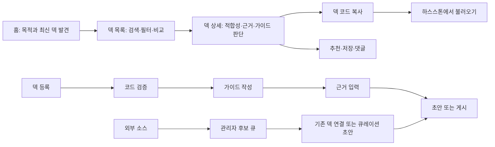

# Information Architecture and UX

## 핵심 사용자 흐름

## 전역 내비게이션

- 덱 찾기
- 초보 추천
- 덱 등록
- 로그인 또는 내 덱
- 운영자에게만 최근 덱 검토

MVP에는 별도 커뮤니티 상단 메뉴를 두지 않는다. 토론은 덱 상세에 귀속시켜
덱 발견과 개선이라는 핵심 작업에서 벗어나지 않게 한다.

## 화면 책임

### 홈

- 검색 시작점
- 현재 패치와 데이터 신뢰 원칙 설명
- 추천, 많이 복사한 덱, 초보 추천, 최근 신뢰 덱 섹션
- 첫 덱 등록 CTA
- 데모 데이터 사용 시 명시적 고지

### 덱 목록

- URL로 공유 가능한 검색·필터·정렬 상태
- 기본값은 현재 패치
- 직업, 태그, 출처 유형, 근거 수준 필터
- 추천, 복사, 최신, 트렌딩 정렬
- 모바일 전체 화면 필터와 선택 필터 개별 해제

### 덱 상세

정보 우선순위는 다음과 같다.

1. 덱 이름, 직업·아키타입, 현재 패치 여부
2. 추천 대상, 난이도, 근거
3. 덱 코드 복사
4. 장점·약점, 운영법, 멀리건
5. 카드 구성과 교체안
6. 추천·저장·댓글
7. 관련 덱

모바일에서는 하단 고정 복사 버튼을 유지한다. 이전 패치 덱은 복사 버튼보다
먼저 경고를 노출하되 복사를 임의로 막지 않는다.

### 덱 등록

1. 코드 붙여넣기와 카드 구성 검증
2. 이름, 요약, 추천 대상, 난이도, 운영법, 멀리건
3. 플레이 출처, 순위, 승·패 기록
4. 최종 검토 후 초안 저장 또는 게시

로그인이 필요한 시점에는 검증한 코드를 세션에 보존하고 로그인 후 복귀한다.
승률 퍼센트 직접 입력은 허용하지 않는다.

### 로그인·마이페이지

- 이메일 매직 링크 로그인
- 내 덱: 초안, 게시됨, 숨김 상태
- 초안 가이드 수정과 게시
- P1에서 즐겨찾기 탭 추가

### 관리자

- 최근 덱 후보 상태별 큐
- 원문, 패치, 코드 검증, 반복 관측, 우선순위 확인
- 승인, 반려, 기존 공개 덱 연결
- 승인 후보를 운영자 소유 초안으로 생성
- P1에서 공식 대회 매니페스트 입력과 사전 검증 추가

## 최소 커뮤니티 구조

범용 게시판 대신 덱 상세에 아래 기능만 둔다.

- 추천: “이 덱 정보가 다른 유저에게 유용하다”는 1인 1표
- 즐겨찾기: 개인 저장, 공개 카운트는 부차적
- 댓글: 덱 사용 경험, 교체 카드, 상성 질문에 한정된 단일 레벨
- 신고: 허위 성적, 스팸, 악성 콘텐츠

댓글 정렬과 답글 트리는 초기 범위에서 제외한다. 덱과 무관한 일반 토론은 기존
커뮤니티가 더 잘 해결하며, HearthDeck Hub의 핵심 루프를 희석한다.

## UX 검증 과업

1. “복귀 유저가 쉬운 현재 패치 전사 덱을 찾아 복사한다.”
2. “대회 덱인지, 승률 근거가 무엇인지 설명한다.”
3. “이전 패치 덱을 구분하고 최신 대안을 찾는다.”
4. “본인 덱 코드를 등록해 초안으로 저장한다.”
5. “운영자가 외부 후보를 검토해 기존 덱에 연결한다.”

관찰 지표는 성공 여부, 완료 시간, 막힌 지점, 신뢰 판단에 사용한 정보다.
