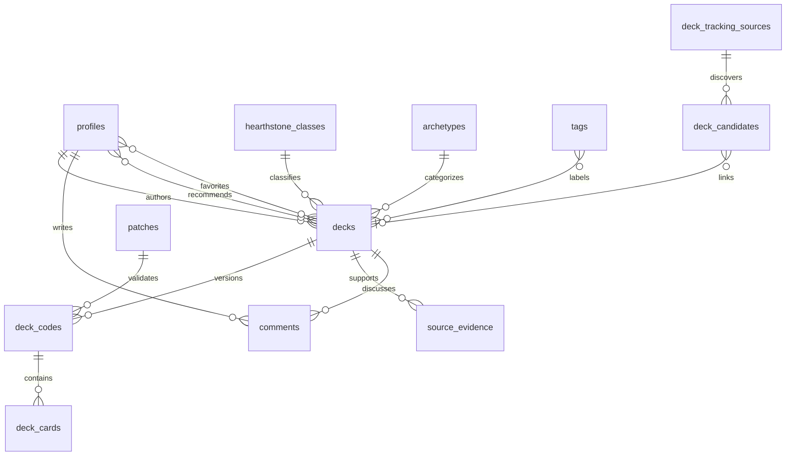

# Data Model

## 핵심 원칙

- 덱 콘텐츠와 덱 코드 버전을 분리한다.
- 공개된 덱 코드 버전은 불변으로 보존한다.
- 플레이 주장과 검토 상태를 출처 근거로 분리한다.
- 추천·즐겨찾기·복사·댓글 카운트는 원본 이벤트에서 계산한다.
- 외부 수집 후보는 공개 덱과 별도 수명주기를 갖는다.

## 주요 엔터티

### User (`profiles`)

`id`, `handle`, `display_name`, `avatar_url`, `bio`, `role`,
`contributor_status`, `locale`, `created_at`, `updated_at`, `deleted_at`

역할은 `user`, `moderator`, `admin`이다. 기여 신뢰 상태와 운영 권한을 분리한다.

### Deck (`decks`)

`id`, `slug`, `author_id`, `title`, `class_id`, `archetype_id`, `format`,
`summary`, `recommended_for`, `difficulty`, `strengths`, `weaknesses`,
`game_plan`, `mulligan_guide`, `card_choices`, `matchup_notes`, `status`,
`verification_status`, `current_deck_code_id`, 집계 카운트, 게시·수정 시각

덱은 설명과 커뮤니티 반응의 단위다. 코드를 수정하는 대신 새 DeckCode 버전을
추가하고 `current_deck_code_id`를 전환한다.

### DeckCode (`deck_codes`)

`id`, `deck_id`, `raw_code`, `code_hash`, `version_number`, `patch_id`,
`format`, `class_id`, `hero_dbf_id`, `card_count`, `parse_status`,
`parser_version`, `created_by`, `created_at`

`deck_cards`가 파싱된 카드와 수량, 사이드보드 관계를 저장한다.

### Class (`hearthstone_classes`)

`id`, `slug`, `name_ko`, `name_en`, `card_class_id`, `color_token`,
`icon_url`, `sort_order`, `is_active`

하스스톤 11개 직업의 기준 데이터다. 다중 직업 카드는 `card_classes`로 연결한다.

### Archetype (`archetypes`)

`id`, `slug`, `name_ko`, `name_en`, `class_id`, `strategy_type`,
`description`, `is_active`

초기에는 운영자가 관리한다. 자동 분류는 별도 검증 없이 적용하지 않는다.

### TournamentDeck

별도 공개 덱 테이블로 중복 저장하지 않는다.

- 수집 전: `deck_candidates` + `deck_tracking_sources`
- 검토 후: 일반 `decks` + `source_evidence(source_type=tournament)`
- 이벤트 원문과 선수 정보: 후보 metadata와 source evidence

장기적으로 선수·대회·라인업 검색이 핵심 사용 사례가 되면 `events`, `players`,
`event_deck_entries`를 정규화한다.

### Comment (`comments`)

`id`, `deck_id`, `author_id`, `parent_id`, `body`, `status`,
`helpful_count`, `created_at`, `updated_at`, `deleted_at`

MVP는 `parent_id is null`인 단일 레벨만 허용한다. 댓글 도움됨은
`comment_likes`에서 집계한다.

### Like and Favorite

- `deck_likes(user_id, deck_id, created_at)`: 공개 추천 신호
- `favorites(user_id, deck_id, created_at)`: 사용자 개인 저장

각 복합 기본키로 1인 1행을 보장한다. 둘을 하나의 reaction 테이블로 합치지
않는다. 공개 추천과 개인 보관은 의미와 노출 정책이 다르다.

### Tag (`tags`, `deck_tags`)

`slug`, `name_ko`, `category`, `description`, `is_editorial`, `is_active`,
`sort_order`

카테고리는 대상, 비용, 난이도, 목표, 편집 태그다. 편집 태그는 운영자만 지정한다.

### SourceEvidence (`source_evidence`)

`source_type`, `source_url`, `source_name`, `claimed_rank`, `wins`, `losses`,
기간, `evidence_status`, 검토자와 검토 시각

승률은 저장하지 않고 승·패에서 계산한다. `source_linked`와 `reviewed`는 URL을
필수로 요구한다.

### Recent-deck tracking

- `deck_tracking_sources`: 출처, 신뢰 티어, 수집 방식과 주기
- `deck_tracking_runs`: 실행 결과와 경고
- `deck_candidates`: 정규화 후보, 코드 검증, 상태, 우선순위
- `deck_candidate_observations`: 반복 관측
- `patch_transitions`: 패치 전환 감사

## 관계 요약

## 데이터 품질 불변식

- 공개 정규전 덱은 현재 코드, 30장 카드 행, 최소 운영법과 멀리건을 갖는다.
- 현재 코드는 같은 덱·직업·포맷과 일치한다.
- 공개 코드 버전과 카드 행은 임의 수정하지 않는다.
- 카운터는 클라이언트가 직접 수정할 수 없다.
- 외부 후보는 유효한 코드 없이는 승인·연결할 수 없다.
- 패치 전환은 과거로 되돌릴 수 없고 감사 행을 남긴다.
